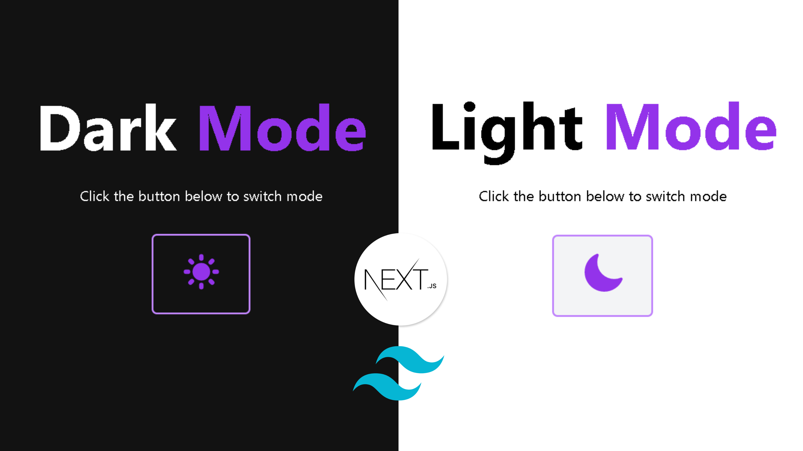

## A dark/light mode toggle created with NextJS and TailwindCSS.

- [x] <b> UseTheme hook </b> from next-themes has been used in order to sync with the theme from windows and tabs but also to manually change it by clicking the button. Find more about Next.js dark mode here (https://github.com/pacocoursey/next-themes)
  
- [x] TailwindCSS dark mode class has been used in order to manually change the theme in selected areas. Find more about TailwindCSS dark mode (https://tailwindcss.com/docs/dark-mode)
  
  

